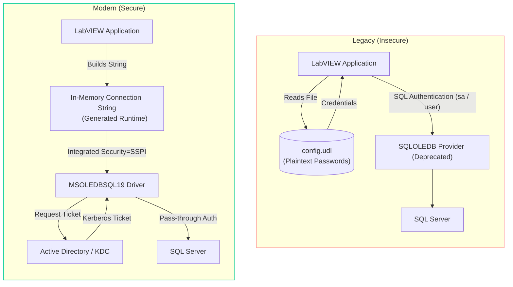
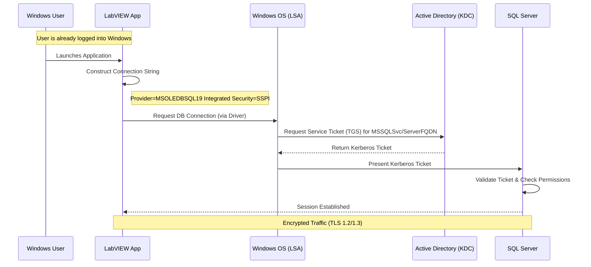
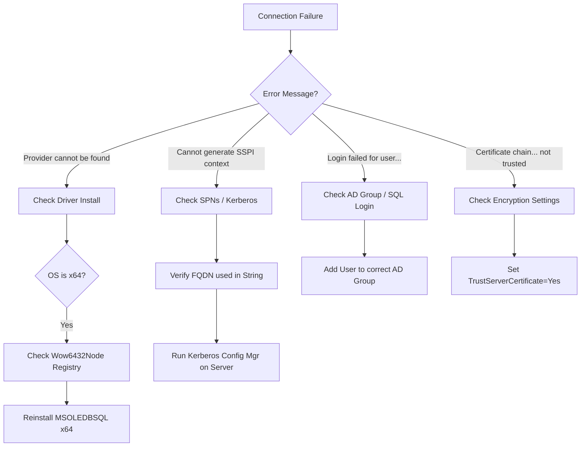

# Client Migration Guide: Database Connectivity & Security Modernization

**Project:** Secure Database Connectivity Migration  
**Target System:** Industrial Automation / LabVIEW Clients  
**Date:** January 13, 2026  
**Version:** 1.0

---

## 1. Executive Summary

This document details the technical migration of the database connectivity layer. The project moves from legacy file-based configuration (`.udl`) and deprecated drivers (`SQLOLEDB`) to the modern, secure **Microsoft OLE DB Driver for SQL Server (MSOLEDBSQL19)**.

The primary objective is to align with **IEC 62443** and **NIST SP 800-82** standards by eliminating plain-text credentials and enforcing **Windows Authentication (Kerberos/SSPI)**. This change ensures that identity management is centralized within Active Directory, providing non-repudiation and robust access control.

---

## 2. Architectural Overview

### 2.1 The Shift from Static to Dynamic Connectivity
Historically, the application relied on an external `.udl` file stored on the disk. This file contained connection parameters, often including the username and password in plain text.

The new architecture removes this dependency. The LabVIEW application now constructs the connection string in-memory at runtime. This "Zero-Trust" approach ensures that no credentials are ever written to disk or exposed to users with file-system access.

### 2.2 Component Diagram (Before vs. After)



---

## 3. Security & Interaction Model

### 3.1 Authentication Flow (Kerberos/SSPI)
The new method utilizes `Integrated Security=SSPI`. This instructs the driver to negotiate an authentication protocol with the Windows operating system. In a properly configured domain environment, this results in **Kerberos** authentication.

**Key Benefits:**
1.  **No Password Handling:** The LabVIEW application never sees or processes the user's password. It uses the security token of the logged-in Windows user (or Service Account).
2.  **Mutual Authentication:** The client verifies the identity of the server (via SPNs), preventing Man-in-the-Middle attacks.
3.  **Auditable:** All access is logged against specific AD users, not generic "operator" SQL accounts.

### 3.2 Sequence of Operations



---

## 4. Implementation Details

### 4.1 Connection String Syntax
The application has been hard-coded or configured to generate the following connection string pattern. Note the use of the `MSOLEDBSQL19` provider, which is critical for TLS 1.2+ support.

```text
Provider=MSOLEDBSQL19;
Server=db-production.factory.local;   <-- Must be FQDN for Kerberos
Database=ProductionDB;
Integrated Security=SSPI;
Use Encryption for Data=Mandatory;
Trust Server Certificate=No;          <-- Set to Yes if using self-signed certs
```

### 4.2 LabVIEW Configuration
*   **Prompt Behavior:** The `DB Tools Open Connection.vi` prompt behavior is set to `adPromptNever` (4). This ensures the application runs headlessly and does not hang waiting for user interaction if authentication fails.
*   **Bitness Compatibility:** The application runs as a 32-bit process. It requires the 32-bit version of the MSOLEDBSQL driver (installed via the x64 installer on 64-bit Windows, which includes both WOW64 components).

### 4.3 LabVIEW Implementation Guide
For detailed instructions on modifying the LabVIEW block diagram, refer to the [LabVIEW Migration Report](reports/LabVIEW_Migration_Changes.md).

**Key Changes:**
*   **Legacy:** Used a static file path (e.g., `C:\config.udl`) wired to `DB Tools Open Connection.vi`.
*   **Modern:** Uses `Format Into String` to build the connection string dynamically.
*   **Logic:** `Provider=MSOLEDBSQL19;Server=%s;Database=%s;...` where `%s` inputs are the Server FQDN and Database Name.

---

## 5. Client Requirements & Deployment

To ensure successful connectivity, the client workstations must be provisioned with the following:

| Component | Requirement | Critical Note | 
| :--- | :--- | :--- |
| **Driver** | **Microsoft OLE DB Driver 19 for SQL Server (x64)** | The x64 installer installs both 64-bit and 32-bit drivers. **Do not** install the x86 version on a 64-bit OS. |
| **Runtime** | **Visual C++ Redistributable (x86)** | Required for the 32-bit driver components used by LabVIEW. |
| **Network** | **DNS Resolution** | The client must be able to resolve the **Fully Qualified Domain Name (FQDN)** of the SQL Server (e.g., `server.domain.com`), not just the IP or NetBIOS name. |
| **Access** | **AD Group Membership** | The user running the app must be in the appropriate Active Directory group (e.g., `CONTOSO\OT_Operators`) that has been granted access in SQL Server. |

---

## 6. Validation & Troubleshooting

If a connection fails, follow this flowchart to identify the root cause.



---
*End of Guide*
